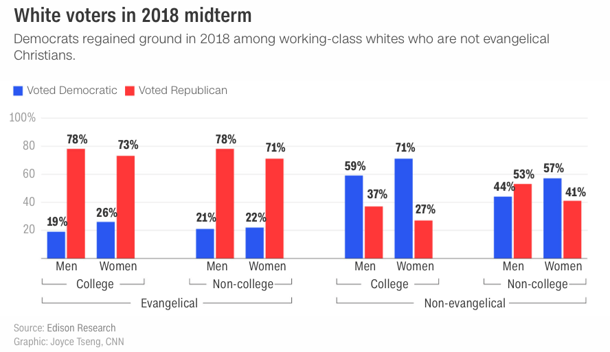

# Storytelling In-Class Exercises/Tutorial

In this set of exercises, we'll explore re-making a chart to better tell the stated headline and reviewing methods to add annotations and layers to charts in R and Vega-Lite. 
 
**Instructions:** Gather into groups of 2-3 students and work together to answer the following questions.  We will discuss each section in class. 

## Part A - Chart Re-make

Recently CNN ran the story ["The foundation of Trump's coalition is cracking"](https://www.cnn.com/2018/12/11/politics/the-foundation-of-trumps-coalition-is-cracking/index.html), which included the bar chart shown below:



When I first looked at this chart, it took some time before I could figure out what it was trying to show.  I think we can do better.

I pulled the data out of the chart and have made it available in 3 formats:
* [Google spreadsheet](https://docs.google.com/spreadsheets/d/1tpj2-qKq67UbVRhUrVo4-QkK1kzfzZASEZMfgUxmm_U/edit?usp=sharing)
* [Excel file](cnn-2018-evangelical.xlsx)
* [CSV file](cnn-2018-evangelical.csv)

Given the CNN article, data, and chart headline, propose a couple different ways that this data could be presented. You may sketch this paper or use any other tool to generate some alternatives.

Along with each of your proposed charts, state what you think the headline should be and note what the viewer would have to do to reach this same conclusion by looking at your chart.

## Part B - Annotations in R Tutorial

"To help others quickly build up a good mental model of the data, you will need to invest considerable effort in making your plots as self-explanatory as possible."

These are some notes to review from [Chapter 28 (Graphics for Communication)](https://r4ds.had.co.nz/graphics-for-communication.html) in [*R for Data Science*](https://r4ds.had.co.nz). This is mainly for reference, but you're encouraged to work through some of the exercises on your own for practice.

**28.2 Label** 

`labs()` - can add title, subtitle, caption, x/y axis titles, legend title

**28.3 Annotations**

`geom_text()` - similar to `geom_point()`, but has the additional aesthetic `label`
* data can come from a tibble (portion of your dataset)

`geom_label()` - draws a rectangle behind the text

`theme(legend.position = "none")` - turns off the legend

Demonstrates example of adding a single label to the chart (e.g., headline inside the chart)

**28.4 Scales**

Note the naming scheme for scales: `scale_` followed by the name of the aesthetic, then `_`, then the name of the scale.

`breaks` - controls the position of the ticks, or the values associated with the keys

`labels` - controls the text label associated with each tick/key

Another use of `breaks` is when you have relatively few data points and want to highlight exactly where the observations occur. See the presidential example at the end of [Section 28.4.1](https://r4ds.had.co.nz/graphics-for-communication.html#axis-ticks-and-legend-keys).

`theme(legend.postion =` {"left", "top", "bottom", "right" (default)}

`scale_colour_brewer()` - set the color scale, uses the RColorBrewer package, set of scales shown at https://r4ds.had.co.nz/graphics-for-communication.html#fig:brewer

`scale_colour_manual()` - set manual colors

**28.5 Zooming**

Using `limits` to share scales among multiple plots.

**28.6 Themes**

`theme_gray()` - default

There are several others available, shown at https://r4ds.had.co.nz/graphics-for-communication.html#fig:themes


## Part C - Annotations in Vega-Lite Examples

Here are several examples of adding annotations to charts in Vega-Lite.  For each of these examples, click on "View this example in the online editor" to see the Vega-Lite code (without the JSON specification).

Simple Bar Chart with data label at end of bar - https://vega.github.io/vega-lite/examples/layer_bar_labels.html

```js
    "encoding": {
      "text": {"field": "b", "type": "quantitative"}
```

Layering text over heatmap - https://vega.github.io/vega-lite/examples/layer_text_heatmap.html

```js
{
      "mark": "text",
      "encoding": {
        "text": {"field": "num_cars", "type": "quantitative"},
        "color": {
          "condition": {"test": "datum['num_cars'] < 40", "value": "black"},
          "value": "white"
        }
      }
```

Line charts with labels near lines - https://vega.github.io/vega-lite/examples/layer_line_co2_concentration.html

```js
    {
      "transform": [{"filter": {"field": "end", "equal": "last"}}],
      "mark": {"type": "text", "baseline": "bottom"},
      "encoding": {"text": {"field": "year", "type": "nominal"}}
    }
```

Horizontal mean line overlay on bar chart - https://vega.github.io/vega-lite/examples/layer_precipitation_mean.html

```js
{
      "mark": "rule",
      "encoding": {
        "y": {
          "aggregate": "mean",
          "field": "precipitation",
          "type": "quantitative"
        },
        "color": {"value": "red"},
        "size": {"value": 3}
      }
    }
```

Vertical mean line overlay on histogram - https://vega.github.io/vega-lite/examples/layer_histogram_global_mean.html

```js
{
    "mark": "rule",
    "encoding": {
      "x": {
        "aggregate": "mean",
        "field": "IMDB_Rating",
        "type": "quantitative"
      },
      "color": {"value": "red"},
      "size": {"value": 5}
    }
```

Line chart with highlighted rectangles - https://vega.github.io/vega-lite/examples/layer_falkensee.html

```js
{
      "mark": "rect",
      "data": {
        "values": [
          {
            "start": "1933",
            "end": "1945",
            "event": "Nazi Rule"
          },
          {
            "start": "1948",
            "end": "1989",
            "event": "GDR (East Germany)"
          }
        ],
        "format": {
          "parse": {"start": "date:'%Y'", "end": "date:'%Y'"}
        }
      }
```
