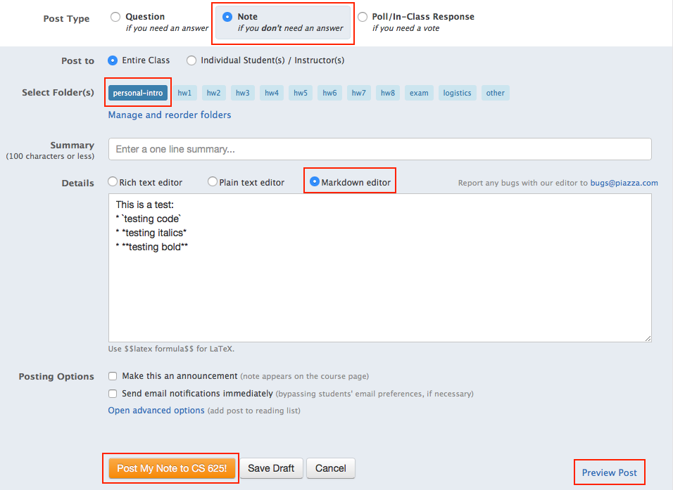

# Personal Introductions in Piazza

**Due:** Tuesday, September 1, 2020 *before* class (9:30am) 

## Assignment

Since only a few students will be able to participate in person this semester, it is important that we all get accustomed to using our online tools to communicate and get to know each other.  This assignment is to help us get started on both of these tasks.  We will use our Piazza group to provide personal introductions to each other.

In your introduction, provide at least the following information:
* Name (include pronunciation help if people often mispronounce your name)
* CS or other major, MS or PhD
* Hometown/home country
* Are you taking this course in-person or online?
* If you are taking the course online, when during the week/day do you expect to view the class meeting video?  (Ex: join during class meeting times, after 7pm on Mon/Wed, after 10pm on Tues/Thurs, only on weekends, etc.)
* Are you a full-time or part-time student?  Do you work full-time?
* Why you are taking this course and what do you expect to gain from it?
* What are your research or computing/technology interests?
* Share one or two interesting things about yourself so that your classmates can get to know you better.

I encourage you to provide additional information if you wish.  You do not have to follow the bulleted list format.

We will look at all of the entries in class on Tuesday.  I encourage you to post early, read your classmates' entries, and reply to your classmates if you have something in common.

## Procedure

Login to our Piazza site (link in Blackboard) and set up your account (click the Gear and then Account/Email Settings), including a picture.  This will only be visible to students in our class.

Create a new Note post (*not reply*) in the `personal-intro` folder to provide your introduction.  Put your name as the "Summary" line. I've already added my introduction as an example for you. 

We will be using Markdown a good bit this semester, so I encourage you to format your introduction using this markup style for practice. Click the "Markdown editor" radio button in the Details section of the Piazza Note editor.  

Click the "Preview Post" link to see a preview (example of the preview pop-up below).  

When you're happy with how your post will look, click "Post My Note to CS 625!"  

More information about the Markdown markup language is available at https://guides.github.com/features/mastering-markdown/.
